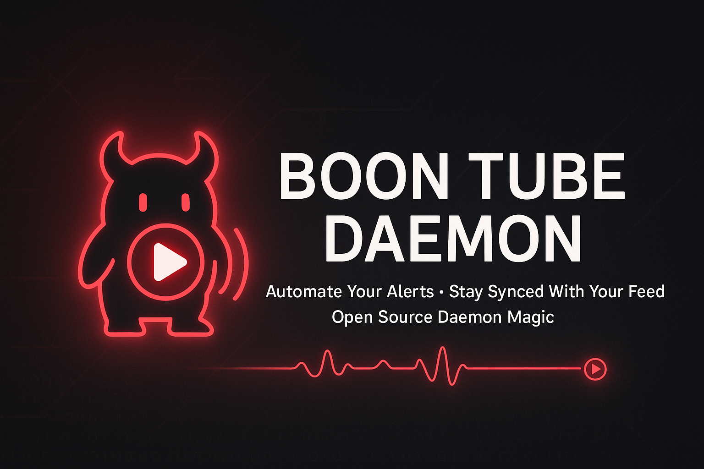

# Boon-Tube-Daemon 🎬

<div align="center">
  
</div>

**Automated YouTube video monitoring with AI-enhanced multi-platform social notifications.**

Monitor YouTube channels for new video uploads and automatically post unique, AI-generated notifications to Discord, Matrix, Bluesky, and Mastodon. Each platform gets a customized post with configurable tone (professional, conversational, detailed, or concise).

## ✨ Key Features

- 📺 **YouTube Monitoring**: Detect new video uploads using YouTube Data API v3
  - Filters livestreams (only notifies for actual video uploads)
  - Supports regular videos and YouTube Shorts
  - Configurable check interval
  
- 🤖 **AI-Powered Posts**: Choose between Ollama (local) or Gemini (cloud) for AI-generated content
  - **Ollama**: Privacy-first local LLM, no API costs, unlimited usage ([Setup Guide](docs/features/ollama-setup.md))
  - **Gemini**: Cloud API, easier setup, 15 req/min free tier
  - Platform-specific tone configuration (professional/conversational/detailed/concise)
  - Smart content summarization with sponsor/URL removal
  - Auto-generated hashtags
  - Respects character limits (Bluesky 300, Mastodon 500)
  - No placeholder text or generic greetings
  
- 📢 **Multi-Platform Notifications**: Post to multiple social platforms simultaneously
  - **Discord**: Rich embeds with platform-specific roles and webhooks
  - **Matrix**: Professional messaging with auto token rotation
  - **Bluesky**: ATProto integration with rich text and clickable links
  - **Mastodon**: Full API support with media attachments
  
- 🔒 **Secure Configuration**: Doppler integration for secrets management
  
- ⚙️ **Highly Configurable**: Custom intervals, per-platform styles, role mentions
  
- � **Production Ready**: Systemd service, error handling, comprehensive logging

## 🎯 Platform Support

| Platform | Status | Features |
|----------|--------|----------|
| YouTube | ✅ Working | Video monitoring, livestream filtering, API v3 |
| Discord | ✅ Working | Rich embeds, roles, webhooks, conversational style |
| Matrix | ✅ Working | Professional style, auto token rotation |
| Bluesky | ✅ Working | ATProto, rich text, 300 char limit, conversational |
| Mastodon | ✅ Working | 500 char limit, media support, detailed style |
| TikTok | ⏳ Planned | Code implemented but blocked by platform API issues* |

**\*TikTok Note**: TikTok support is planned but currently non-functional due to their restrictive API approval process, sandbox limitations causing "server_error" responses, and bot detection mechanisms. The OAuth implementation exists but TikTok's approach to API access, app approval, and developer sandbox makes reliable integration extremely difficult. Focus is on the 5 working platforms above.

## 🚀 Quick Start

```bash
# 1. Clone and setup
git clone https://github.com/chiefgyk3d/Boon-Tube-Daemon.git
cd Boon-Tube-Daemon
./setup.sh

# 2. Configure environment
cp .env.example .env
nano .env  # Configure YouTube channel, platform settings

# 3. Setup AI provider (choose one)

# Option 1: Ollama (local, privacy-first, no costs)
# Install on your LLM server:
curl -fsSL https://ollama.com/install.sh | sh
ollama pull gemma2:2b
ollama serve

# In .env:
LLM_ENABLE=true
LLM_PROVIDER=ollama
LLM_OLLAMA_HOST=http://localhost  # Or your server IP
LLM_OLLAMA_PORT=11434
LLM_MODEL=gemma2:2b
LLM_ENHANCE_NOTIFICATIONS=true

# Option 2: Google Gemini (cloud API)
# Get API key from: https://aistudio.google.com/app/apikey
# In Doppler or .env:
LLM_ENABLE=true
LLM_PROVIDER=gemini
GEMINI_API_KEY=your_api_key_here
LLM_ENHANCE_NOTIFICATIONS=true

# 4. Test Ollama (if using)
python3 tests/test_ollama.py

# 5. Test platforms
cd tests
python test_youtube.py
python test_all_platforms.py

# 6. Run daemon
doppler run -- python boon_tube_daemon/main.py
# Or without Doppler:
python3 main.py

# 7. Deploy as systemd service (optional)
sudo ./scripts/install-systemd.sh
sudo systemctl start boon-tube-daemon
sudo systemctl enable boon-tube-daemon
```

### Alternative: Docker Deployment

```bash
# Pull from GitHub Container Registry
docker pull ghcr.io/chiefgyk3d/boon-tube-daemon:latest

# Run with docker-compose
docker-compose up -d

# Or deploy as systemd service with Docker
sudo ./scripts/install-systemd.sh  # Choose Docker mode
```

See [scripts/README.md](scripts/README.md) for more deployment options.

## 📁 Project Structure

```
Boon-Tube-Daemon/
├── boon_tube_daemon/           # Main application package
│   ├── media/                  # YouTube monitoring
│   │   └── youtube.py         # YouTube Data API v3 integration
│   ├── social/                 # Social platform integrations
│   │   ├── discord.py         # Discord webhooks & rich embeds
│   │   ├── matrix.py          # Matrix client API
│   │   ├── bluesky.py         # Bluesky ATProto
│   │   └── mastodon.py        # Mastodon API
│   ├── llm/                    # AI enhancement
│   │   ├── gemini.py          # Gemini 2.5 Flash Lite (cloud)
│   │   └── ollama.py          # Ollama local LLM (privacy-first)
│   ├── utils/                  # Utilities
│   │   ├── config.py          # Configuration management
│   │   └── secrets.py         # Doppler integration
│   └── main.py                 # Main daemon
├── tests/                      # Test scripts
├── scripts/                    # Utility scripts
│   ├── install-systemd.sh     # Install as systemd service
│   ├── uninstall-systemd.sh   # Remove systemd service
│   ├── create-secrets.sh      # Interactive secrets wizard
│   └── setup_matrix_bot.sh    # Matrix bot setup helper
├── docs/                       # Documentation
│   ├── setup/                  # Platform setup guides
│   └── legal/                  # Legal documents
├── docker/                     # Docker configuration
│   ├── Dockerfile             # Optimized build (652MB)
│   └── README.md              # Docker usage guide
├── .env.example               # Configuration template
└── README.md                  # This file
```

## 📚 Documentation

- 📖 [Platform Status](PLATFORM_STATUS.md) - Current platform support details
- ⚡ [Quick Start Guide](docs/QUICKSTART.md) - Detailed setup instructions
- 🤖 [Ollama Setup Guide](docs/features/ollama-setup.md) - **Local AI setup (recommended)**
- 🔧 [Platform Setup Guides](docs/setup/) - Discord, Matrix, Bluesky, Mastodon
- �️ [Utility Scripts](scripts/README.md) - Installation and secrets management
- 🐳 [Docker Guide](docker/README.md) - Docker deployment and GHCR
- �🔑 [Doppler Setup](docs/DOPPLER_SETUP.md) - Secrets management
- 📺 [YouTube Setup](docs/YOUTUBE_SETUP.md) - API key configuration
- 🤝 [Contributing Guide](docs/CONTRIBUTING.md) - Development guidelines
- 📋 [Changelog](docs/CHANGELOG.md) - Version history

## ⚙️ Configuration

### Platform Posting Styles

Each platform can be configured with a different tone:

```env
# Available styles: professional, conversational, detailed, concise
DISCORD_POST_STYLE=conversational
MATRIX_POST_STYLE=professional
BLUESKY_POST_STYLE=conversational
MASTODON_POST_STYLE=detailed
```

### Example Configurations

**Discord**: Conversational, friendly tone with emojis
**Matrix**: Professional, informative style
**Bluesky**: Conversational, concise (300 char limit)
**Mastodon**: Detailed analysis with hashtags (500 char limit)

## 📋 Requirements

### Core
- Python 3.8+
- YouTube Data API v3 key
- **AI Provider (choose one):**
  - **Ollama** (recommended): Local LLM server, no API costs ([Setup Guide](docs/features/ollama-setup.md))
  - **Gemini**: API key from Google AI Studio
- Doppler CLI (optional, for secrets management)

### Social Platforms (at least one required)
- **Discord**: Webhook URL, optional role IDs
- **Matrix**: Homeserver, username, password, room ID
- **Bluesky**: Handle, app password
- **Mastodon**: Instance URL, access token

## 🎨 Features in Detail

### AI-Generated Posts
Each platform receives a unique, AI-generated post based on the video content:

**Provider Options:**
- **Ollama (Recommended)**: Privacy-first local LLM with no API costs
  - Run on your own hardware
  - No data sent to external services
  - No rate limits
  - Models: gemma2:2b, gemma3:4b, llama3.2:3b, mistral:7b, etc.
  - See [Ollama Setup Guide](docs/features/ollama-setup.md)

- **Google Gemini**: Cloud API alternative
  - Easier initial setup
  - No local hardware needed
  - 15 requests/minute (free tier)
  - Gemini 2.5 Flash Lite model

**Features:**
- **Content Analysis**: AI analyzes video title, description, and metadata
- **Sponsor Removal**: Automatically strips sponsor sections and promotional URLs
- **Smart Summarization**: Creates engaging summaries appropriate for each platform
- **Hashtag Generation**: Adds relevant hashtags based on content
- **Character Limits**: Strictly respects platform limits (Bluesky 300, Mastodon 500)
- **No Placeholders**: Never includes placeholder URLs or generic text

### Livestream Detection
YouTube monitoring intelligently filters content:

- **Videos Only**: Only notifies for actual video uploads (including Shorts)
- **Skips Livestreams**: Filters out live content and livestream recordings
- **Smart Detection**: Checks video type and live streaming details

### Platform-Specific Features

**Discord**
- Rich embeds with color coding
- Platform-specific roles (@YouTube, @TikTok when implemented)
- Per-platform webhooks for channel organization
- Conditional stats display (views/likes when available)

**Matrix**
- Professional formatted messages
- Automatic token rotation
- Proper room ID handling
- Markdown support

**Bluesky**
- Rich text with clickable links
- Hashtag support
- Smart livestream indicator (only for actual streams)
- ATProto integration

**Mastodon**
- Media attachment support
- Hashtag optimization
- 500 character detailed analysis
- Full API compliance

## 🔧 Troubleshooting

### YouTube API Quota
- Free tier: 10,000 units/day
- Each check: 3 units
- ~3,300 checks/day possible
- **Default interval: 15 minutes** (96 checks/day = 288 units)
- Leaves quota headroom for Stream-Daemon (livestream monitoring at 1-2 min intervals)

### Gemini API Quota
- Model: gemini-2.5-flash-lite
- Free tier: 1,000 requests/day, 15 requests/minute
- Sufficient for most use cases

### Common Issues
- **No videos found**: Check YouTube channel ID and API key
- **Discord not posting**: Verify webhook URL in Doppler
- **Character limit errors**: Check platform-specific limits in logs
- **Matrix authentication**: Ensure correct homeserver and credentials

See [docs/setup/](docs/setup/) for detailed platform setup guides.

## 🤝 Contributing

Contributions are welcome! See [CONTRIBUTING.md](docs/CONTRIBUTING.md) for guidelines.

### Development Setup
```bash
# Install dependencies
pip install -r requirements.txt

# Run tests
cd tests
python test_all_platforms.py

# Test individual components
python test_youtube.py
python test_llm_posts.py
```

## 📜 Legal

### License
**Mozilla Public License 2.0** - See [LICENSE](LICENSE)

This project is licensed under the MPL-2.0, which allows you to use, modify, and distribute this software while requiring that modifications to MPL-licensed files remain open source.

### Privacy & Terms
- 📜 [Privacy Policy](docs/legal/PRIVACY_POLICY.md) - No data collection, fully self-hosted
- 📋 [Terms of Service](docs/legal/TERMS_OF_SERVICE.md) - Open source, use at your own risk

**Important:** You are responsible for complying with third-party service terms (YouTube, Discord, Matrix, Bluesky, Mastodon) when using this software. This tool is for personal/non-commercial use monitoring your own channels or channels you have permission to monitor.

## 🙏 Acknowledgments

- YouTube Data API v3
- Google Gemini AI
- Discord Webhooks
- Matrix Protocol
- Bluesky ATProto
- Mastodon API
- Doppler Secrets Management

---

## 💝 Support This Project

If you find Boon-Tube-Daemon useful, consider supporting continued development.
Everything is also collected at **[support.chiefgyk3d.com](https://support.chiefgyk3d.com)**.

### Recurring Support

<div align="center">
<table>
  <tr>
    <td align="center" width="150">
      <a href="https://patreon.com/chiefgyk3d" title="Patreon">
        <br>
        <sub><b>Patreon</b></sub>
      </a>
    </td>
    <td align="center" width="150">
      <a href="https://streamelements.com/chiefgyk3d/tip" title="StreamElements">
        <br>
        <sub><b>StreamElements</b></sub>
      </a>
    </td>
    <td align="center" width="150">
      <a href="https://shop.chiefgyk3d.com/" title="Merch Store">
        <br>
        <sub><b>Merch Store</b></sub>
      </a>
    </td>
  </tr>
</table>
</div>

### Cryptocurrency Tips

<div align="center">
<table>
  <tr>
    <td align="center" width="60"></td>
    <td><b>Bitcoin</b><br><code>bc1qztdzcy2wyavj2tsuandu4p0tcklzttvdnzalla</code></td>
  </tr>
  <tr>
    <td align="center" width="60"></td>
    <td><b>Monero</b><br><code>84Y34QubRwQYK2HNviezeH9r6aRcPvgWmKtDkN3EwiuVbp6sNLhm9ffRgs6BA9X1n9jY7wEN16ZEpiEngZbecXseUrW8SeQ</code></td>
  </tr>
  <tr>
    <td align="center" width="60"></td>
    <td><b>Ethereum</b><br><code>0x554f18cfB684889c3A60219BDBE7b050C39335ED</code></td>
  </tr>
  <tr>
    <td align="center" width="60"></td>
    <td><b>Solana</b><br><code>5T8h3HbyvHgLxwXgchRYbHSqRjZyAr8J7uwjLN9Fh8Jh</code></td>
  </tr>
</table>
</div>

---

## 👤 Author & Socials

<div align="center">
<table>
  <tr>
    <td align="center" width="90"><a href="https://social.chiefgyk3d.com/@chiefgyk3d" title="Mastodon"><br><sub>Mastodon</sub></a></td>
    <td align="center" width="90"><a href="https://bsky.app/profile/chiefgyk3d.com" title="Bluesky"><br><sub>Bluesky</sub></a></td>
    <td align="center" width="90"><a href="https://twitch.tv/chiefgyk3d" title="Twitch"><br><sub>Twitch</sub></a></td>
    <td align="center" width="90"><a href="https://www.youtube.com/channel/UCvFY4KyqVBuYd7JAl3NRyiQ" title="YouTube"><br><sub>YouTube</sub></a></td>
    <td align="center" width="90"><a href="https://kick.com/chiefgyk3d" title="Kick"><br><sub>Kick</sub></a></td>
    <td align="center" width="90"><a href="https://www.tiktok.com/@chiefgyk3d" title="TikTok"><br><sub>TikTok</sub></a></td>
    <td align="center" width="90"><a href="https://discord.chiefgyk3d.com" title="Discord"><br><sub>Discord</sub></a></td>
    <td align="center" width="90"><a href="https://matrix-invite.chiefgyk3d.com" title="Matrix"><br><sub>Matrix</sub></a></td>
  </tr>
</table>
</div>

<div align="center"><sub>Made with ❤️ by <a href="https://github.com/ChiefGyk3D">ChiefGyk3D</a></sub></div>
